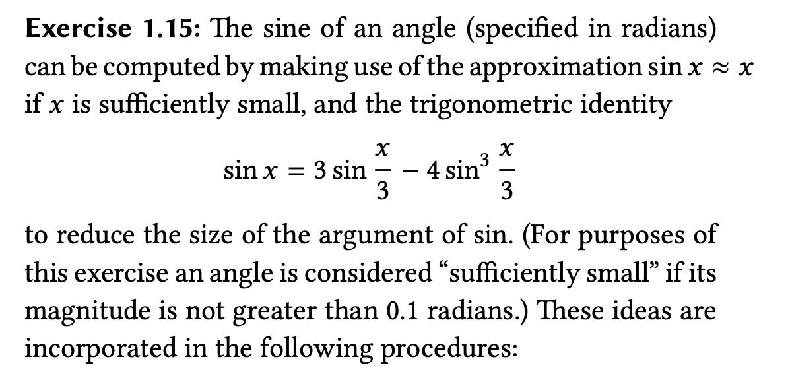

####  Exercise 1.15 



代码为：

```scheme
(define (cube x) (* x x x))
(define (p x) (- (* 3 x) (* 4 (cube x))))
(define (sine angle)
   (if (not (> (abs angle) 0.1))
       angle
       (p (sine (/ angle 3.0)))))
```

问题为：


a问题易得，可以通过如下计算求解:

$\frac{12.15}{3} = 4.05, \frac{4.05}{3} = 1.35, \frac{1.35}{3} = 0.45, \frac{0.45}{3} = 0.15, \frac{0.15}{3}=0.05$

也就是 `5`次。

b问题，不易得，过程如下：

可以看出 `a` 值会不断被3除，直至其值小于 `0.1` ，由此可以得到 $\frac{a}{3^{n}} < 0.1$ ，则有:
$$
\frac{a}{0.1} < 3^{n}
$$

$$
log(\frac{a}{0.1}) < log(3^{n})
$$

$$
log(a)-log(0.1)<n\times log(3)
$$

$$
\frac{log(a)-log(1)}{log(3)} < n
$$

从公式可以看出，最后的时间复杂度也就是 $log(a)$。

